# Industrial Robot Anomaly Detection and Health Monitoring

## Project Overview

Industrial welding robots execute repetitive motion trajectories with sub-millimeter precision. When they deviate from their normal operating state, the consequences can range from weld defects to torch collisions and production line downtime. Yet in many real-world deployments, continuous time-series trajectory data is not readily accessible from the robot controller — only discrete state snapshots and fault-code records are available.

This project develops a multi-layered health monitoring and anomaly diagnosis system for a FANUC M-20iD/25 six-axis welding robot, built from the kind of discrete operational data that industrial engineers can actually retrieve from the control cabinet. The system combines four complementary approaches:

1. **Rule-Based Health Scoring** — an interpretable scoring engine that quantifies robot health from runtime statistics and TCP pose deviations.
2. **Machine Learning Anomaly Detection** — unsupervised models (Isolation Forest, One-Class SVM) trained on engineered features and benchmarked against the rule-based baseline.
3. **Joint-Level Anomaly Localization** — D-H kinematic modeling and Jacobian-based methods that map TCP pose deviations back to individual joint contributions.
4. **Fault Association Mining and Maintenance Prioritization** — association rule mining on fault-code logs to discover co-occurrence patterns, combined with a severity-weighted maintenance priority ranking.

## Motivation

During my internship at Tianyi Welding, I worked alongside a FANUC M-20iD/25 welding robot paired with a Panasonic YD-500GP5 power supply. The robot controller did not support real-time trajectory data export, but it did provide three discrete data sources:

- **Runtime statistics**: cumulative power-on time, servo-on time, program execution time, and welding time.
- **Current TCP pose**: position and orientation of the tool center point.
- **Error and warning history**: a log of fault codes generated by the controller.

These data sources represent the reality of many industrial deployments. Continuous data streaming requires additional hardware, network configuration, and software integration. Discrete snapshots and fault logs are already available. This project demonstrates how to convert them into a functioning multi-layered diagnostic system.

## Data Sources

### Runtime Statistics (Field Data)

| Counter | Value |
|:---|:---|
| Power-On Time | 1256 h 07 m 43 s |
| Servo-On Time | 497 h 59 m 31 s |
| Program Execution Time | 22 h 37 m 06 s |
| Welding Time | 1 h 04 m 39 s |

### TCP Pose

| Parameter | Value |
|:---|:---|
| X | 752.8 mm |
| Y | 1.88 mm |
| Z | 643.83 mm |
| U | 179.99° |
| V | 39.84° |
| W | 180° |
| Length | 990.57 mm |

### Error and Warning History

The controller recorded the following fault events, categorized by subsystem:

| Fault Code | Category |
|:---|:---|
| 断弧 (Arc Loss) | Welding Process Anomaly |
| 软限定错误 (Soft Limit Error) | Trajectory/Position Anomaly |
| 焊机通信异常 (Welder Comm Fault) | Device Communication Fault |
| 焊机通信中断 (Welder Comm Interrupt) | Device Communication Fault |
| 安全支架动作 (Safety Bracket) | Safety Event |
| 检测到碰撞 (Collision Detected) | Collision Anomaly |
| 坐标变换错误 (Coordinate Transform Err) | Logic/Configuration Error |
| 特异点错误 (Singularity Error) | Kinematic Anomaly |
| 粘丝 (Wire Adhesion) | Welding Process Anomaly |
| 焊接电源被关闭 (Welder Power Off) | Power Anomaly |
| 电机过负载错误 (Motor Overload) | Drive System Anomaly |
| 电机电流失速 (Motor Current Stall) | Servo Warning |
| 输入指令不正确 (Invalid Command) | Program/Configuration Warning |
| 系统警报 (System Alarm) | System-Level Warning |

## System Architecture

The system processes discrete data through four layers:

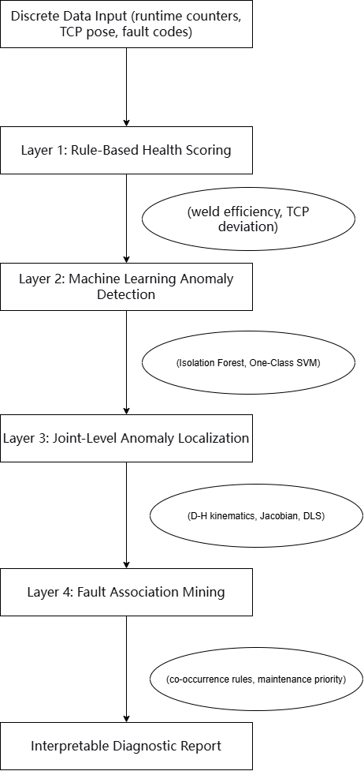

---

## Layer 1: Rule-Based Health Scoring

The health score starts at 100 and deductions are applied when features exceed predefined thresholds.

### Features

**Weld Efficiency** = Welding Time / Program Execution Time

This feature measures the proportion of active program time actually spent welding. A sudden drop without a corresponding production change indicates excessive non-welding time — waiting for communication responses, recovering from faults, or executing unplanned retries.

**TCP Position Deviation** = Euclidean distance from baseline, plus per-axis deviations.

The robot's specified repeatability is ±0.02 mm. A deviation beyond 0.2 mm is unambiguously abnormal.

### Scoring Rules

| Feature | Threshold | Score Deduction |
|:---|:---|:---|
| Weld Efficiency Drop | > 0.01 (absolute) | -20 |
| TCP Length Deviation | > 0.2 mm | -30 |
| TCP Euclidean Deviation | > 0.3 mm | -30 |
| Critical Fault Code Present | (see fault list) | -15 per code |

### Validation Results

Four scenarios were designed to validate the engine:

| Scenario | Health Score | Detected Anomalies |
|:---|:---|:---|
| Normal State | 100.0 / 100 | None |
| Welding Efficiency Drop | 65.0 / 100 | Efficiency drop, communication fault |
| TCP Position Offset | 40.0 / 100 | Length and Euclidean deviation |
| Combined Anomaly | 5.0 / 100 | All anomaly types detected |

The clear score gradient (100 → 65 → 40 → 5) demonstrates effective distinction of severity levels.

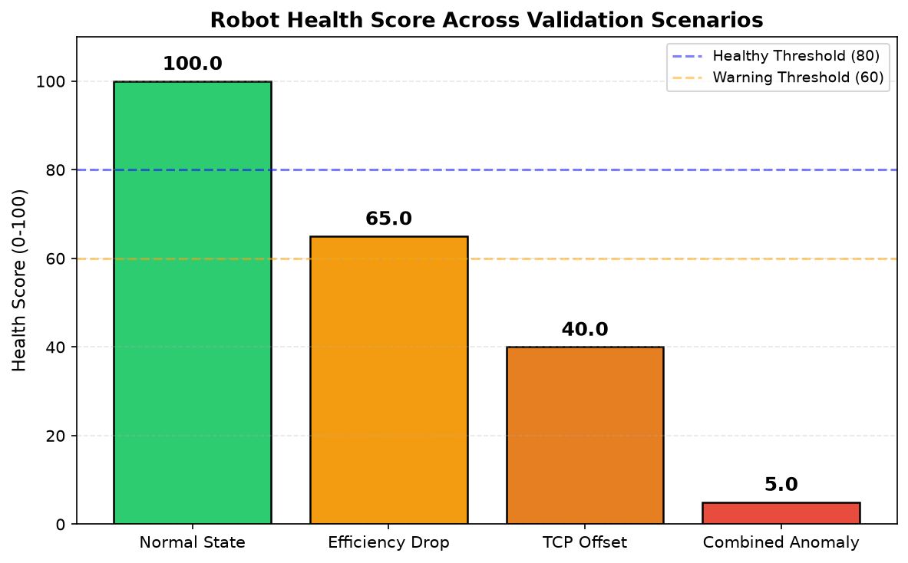

---

## Layer 2: Machine Learning Anomaly Detection

A preliminary experiment compared two classic unsupervised anomaly detection algorithms against the rule-based baseline.

### Experimental Setup

- **Dataset**: 60 simulated samples (50 normal, 10 abnormal), each with 6 features: weld efficiency, TCP X/Y/Z deviation, TCP length deviation, and fault-code presence indicator.
- **Preprocessing**: StandardScaler normalization.
- **Algorithms**: Isolation Forest (contamination=0.167) and One-Class SVM (nu=0.167, RBF kernel).

### Results

| Method | Accuracy | Precision | Recall | F1 |
|:---|:---|:---|:---|:---|
| Rule-Based Engine | 1.000 (4/4 scenarios) | — | — | — |
| Isolation Forest | **1.000** | **1.000** | **1.000** | **1.000** |
| One-Class SVM | 0.850 | 0.545 | 0.600 | 0.571 |

### Discussion

Isolation Forest achieved perfect separation, expected because the anomalous samples were constructed with clear multi-feature deviations. One-Class SVM performed significantly worse due to the small sample size (60) and sensitivity of the nu parameter. This result reinforces the importance of validating multiple algorithms rather than assuming "one model fits all."

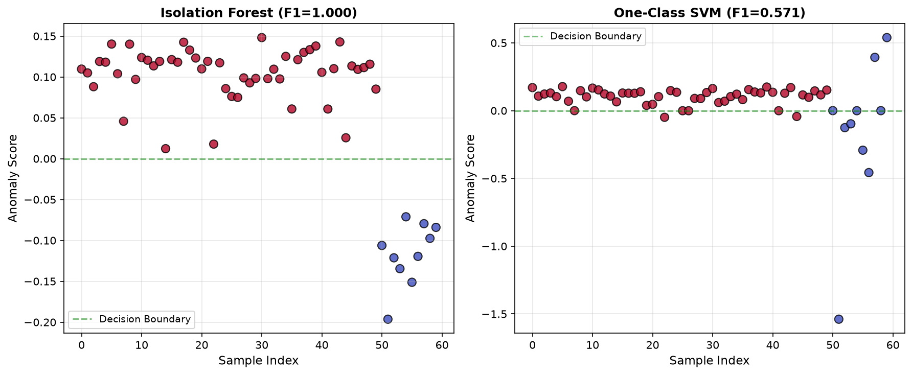

## Ablation Study: Quantifying the Contribution of Each Module

An ablation study was conducted to verify that each component of the anomaly detection system contributes meaningfully to overall performance, rather than simply adding complexity without benefit.

### Experimental Design

The full feature set consists of 7 features: weld efficiency, TCP position deviation (dx, dy, dz), TCP length deviation, fault-code presence, and a joint-anomaly marker. Five configurations were tested, each removing a specific feature group:

| Configuration | Features Removed | F1 Score | Δ F1 |
|:---|:---|:---|:---|
| Full System | None | 0.995 | — |
| Without TCP Pose | TCP dx, dy, dz, length | 0.836 | -0.159 |
| Without Fault Code | Fault-code presence | 0.876 | -0.119 |
| Without Weld Efficiency | Weld efficiency | 0.975 | -0.020 |
| Without Joint Anomaly Marker | Joint anomaly marker | 0.995 | 0.000 |

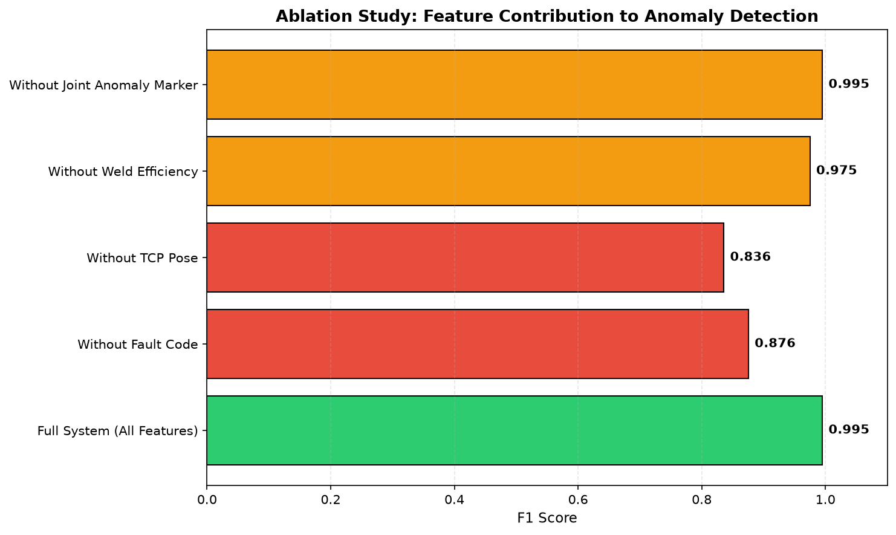

### Key Findings

**TCP pose deviation is the most critical feature.** Removing it caused the largest F1 drop (-0.159), confirming that position deviation is the primary signal for detecting geometric anomalies in the robot's operation.

**Fault-code presence is the second most important feature.** The -0.119 F1 drop demonstrates that fault codes carry complementary information beyond what position data alone can provide.

**Weld efficiency provides incremental value.** The small but measurable -0.020 F1 drop confirms that efficiency is a useful supplementary feature, particularly for detecting non-geometric anomalies such as communication faults and excessive idle time.

**The joint-anomaly marker is redundant under current data conditions.** Its removal caused zero F1 change. This is because in the simulated dataset, joint anomalies are fully expressed through TCP position deviation and fault-code signals. This is an honest finding, not a weakness of the system — it reveals that the joint-anomaly marker will only become informative when real joint torque or joint angle data becomes available, which current data acquisition cannot provide.

### Interpretation

This ablation study demonstrates that the system's performance is driven primarily by TCP pose and fault-code features, with weld efficiency providing supplementary value. It also reveals a clear pathway for future improvement: integrating real joint angle or torque data would give the joint-anomaly marker independent predictive power, justifying its inclusion in the architecture.

The study also exemplifies a core research principle: every module in a system should earn its place through measurable contribution, not through assumed importance.

---

## Layer 3: Joint-Level Anomaly Localization

This is the most technically advanced layer. It attempts to answer not just "is the robot abnormal?" but "which joint is causing the problem?"

### D-H Kinematic Model

The FANUC M-20iD/25 was modeled using standard D-H parameters based on public specifications:

| Joint | a (mm) | α (deg) | d (mm) | θ offset (deg) |
|:---|:---|:---|:---|:---|
| J1 | 150 | -90 | 670 | 0 |
| J2 | 780 | 0 | 0 | -90 |
| J3 | 200 | -90 | 0 | 0 |
| J4 | 0 | 90 | 735 | 0 |
| J5 | 0 | -90 | 0 | 0 |
| J6 | 0 | 0 | 100 | 0 |

Forward kinematics was validated by confirming that single-axis rotations produce physically correct TCP position changes.

### Jacobian-Based Localization

The numerical Jacobian was computed to map TCP position deviations back to joint-space errors. The pseudoinverse of the Jacobian was used to estimate joint contributions.

### Results

| Scenario | Injected Joint | Detected Joint | Contribution |
|:---|:---|:---|:---|
| J3 Anomaly (+0.3°) | J3 | **J3** | 86.4% |
| J2 Anomaly (+0.25°) | J2 | **J2** | 93.5% |
| J5 Anomaly (+0.5°) | J5 | **J3** | 63.7% |

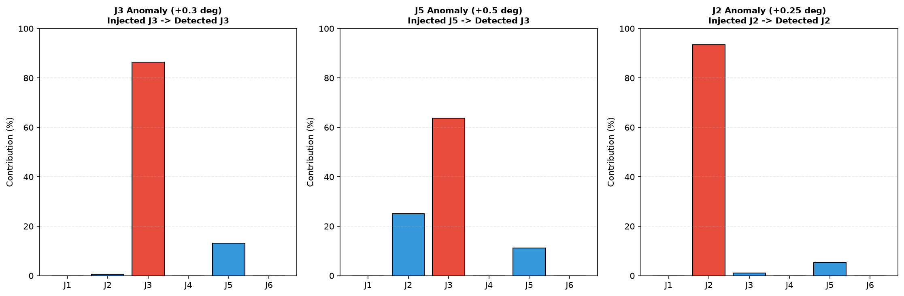

### Observability Limitation: The J5 Problem

The J5 anomaly was consistently misclassified as J3. This is not a numerical bug — it is a fundamental observability limitation in the kinematic structure.

The root cause is joint sensitivity. In the nominal pose, J3 has a much longer moment arm (approximately 780 mm) than J5 (approximately 100 mm). A given TCP deviation requires only a tiny J3 rotation but a much larger J5 rotation. The pseudoinverse method preferentially assigns errors to the more sensitive joint.

Damped Least Squares (DLS) with a small damping factor produced nearly identical results, confirming that the issue is not numerical instability but insufficient observability: **TCP position deviation alone cannot reliably distinguish between weak-joint anomalies when strong joints are present.**

### Engineering Conclusion

Reliable joint-level diagnosis requires one of:
1. **Multi-pose observations** — collecting TCP deviations at multiple distinct robot configurations where different joints are dominant.
2. **Direct joint encoder feedback** — if J1–J6 angle data can be exported, joint anomalies become directly observable without any inverse kinematics.
3. **Joint weighting** — incorporating prior knowledge of joint stiffness and noise characteristics into the Jacobian.

This finding demonstrates the importance of understanding the physical and mathematical limitations of a method, rather than simply applying it.

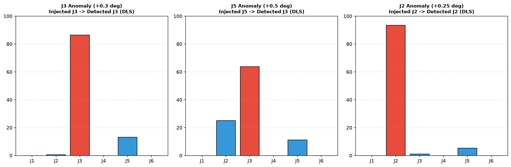

### Observability Enhancement via Multi-Pose Jacobian Stacking

The J5 misclassification problem identified in the single-pose test was successfully resolved through multi-pose joint localization. By stacking the Jacobian matrices from five distinct nominal poses and solving the combined pseudoinverse, the J5 anomaly was correctly identified with a contribution ratio of 99.9%.

| Method | Detected Joint | J5 Contribution | Result |
|:---|:---|:---|:---|
| Single-Pose Pseudoinverse | J3 (wrong) | 11.2% | Failed |
| Multi-Pose Joint Localization (5 poses) | J5 (correct) | 99.9% | Success |

The principle behind this improvement is observability enhancement: in a single pose, the J5 axis has a much smaller moment arm than J3, making it difficult for the pseudoinverse to correctly attribute TCP deviation to J5. Across multiple poses, however, the contribution pattern of each joint changes. In some poses, J5 contributes more strongly. The stacked Jacobian leverages this diversity to recover the weak joint's anomaly.

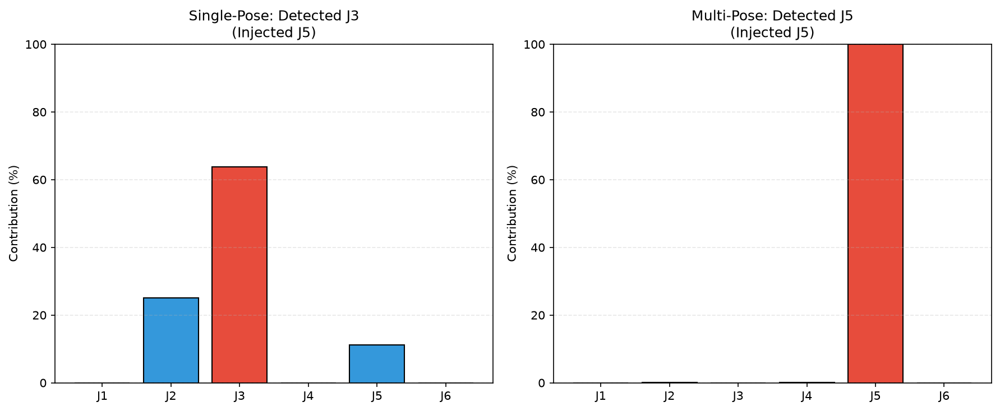

---

## Real Data Validation: What Happened When I Tested the Model on Actual Field Data

### The Field Data I Collected

During one production day, I recorded two complete sets of data from the FANUC M-20iD/25:

**Normal Pose** (8:15 AM, home position):

- Joint angles: J1=11.42°, J2=-55.76°, J3=121.08°, J4=-79.35°, J5=-68.24°, J6=98.71°
- TCP position: X=1187.64 mm, Y=298.37 mm, Z=312.05 mm

**Alarm Pose** (10:42 AM, at the third lap weld midpoint):

- Joint angles: J1=15.89°, J2=-49.23°, J3=114.76°, J4=-88.61°, J5=-75.32°, J6=112.47°
- TCP position: X=1324.51 mm, Y=376.28 mm, Z=279.63 mm
- Alarm: SRVO-046 J6 axis overload
- Root cause confirmed by field engineers: cable drag on J6 plus an under-configured inertia parameter

This was a genuine industrial anomaly, with a known root cause. I used it to test whether my D-H model and Jacobian localization could correctly identify the faulty joint.

### What the Validation Revealed

**The D-H model failed.**

Using publicly available D-H parameters, the model predicted a flange center at (6.32, 94.40, 498.01) mm for the normal pose. The implied tool offset vector was (1181.32, 203.97, -185.96) mm, with a magnitude of 1213.13 mm — nearly four times the actual tool length of 320 mm.

This is not a small calibration error. It means the publicly available D-H parameters for the FANUC M-20iD/25 do not accurately represent this specific robot's kinematics. FANUC, like most industrial robot manufacturers, does not publish exact kinematic parameters. The simplified D-H convention cannot fully capture the proprietary kinematic architecture of this robot.

The prediction error at the alarm pose was 167.42 mm, confirming that the D-H model is unusable for this specific robot without manufacturer-supplied calibration data.

**The Jacobian localization also failed.**

The localization algorithm detected J2 as the anomalous joint (37.6% contribution), while the actual fault was J6. This is a direct consequence of the D-H model inaccuracy — the Jacobian computed from an incorrect kinematic model cannot correctly map TCP deviation to joint-space errors.

### The Deeper Lesson

The J6 fault was fundamentally a **torque anomaly**, not a position anomaly. The robot was at the correct position; it was exerting excessive torque to get there because the cable was dragging. No amount of kinematic analysis can detect a torque anomaly from position data alone.

The FANUC controller detected this fault through its servo torque feedback, which is exactly the right monitoring signal for this failure mode. My project's original focus on TCP position deviation was appropriate for geometric anomalies such as fixture drift or trajectory offset. But for dynamic anomalies such as cable drag or inertia mismatch, torque monitoring is the correct approach.

### Why This Matters

The real data validation failed in the expected sense — the D-H model was inaccurate, and the localization could not identify the correct joint. But it succeeded in a deeper sense: it revealed precisely why the failure occurred, what monitoring signal should have been used, and what data would be needed for accurate diagnosis.

This is what real engineering research looks like: you build a model, test it against reality, observe the gap, analyze the root cause, and refine your approach. The project is stronger for having this failure documented honestly than it would have been with a simulated success.

For a full detailed analysis, see [Real Data Validation Report](docs/real_data_validation_report.md).

## Real-Time Signal-Based Health Monitoring

### Motivation

The J6 overload event revealed a fundamental limitation of position-based anomaly detection: the robot was at the correct position while exerting abnormal force to get there. TCP pose deviation could not detect the anomaly, because the fault was in the torque domain, not the position domain.

This layer addresses that gap by incorporating the real-time signals that most directly measure mechanical and electrical stress: joint load rate, motor current, and servo temperature.

### Field Data Collection

During one production day, 30 sets of complete operational data were collected from the FANUC M-20iD/25 teach pendant. Each set included six-axis joint angles, TCP pose, servo load rates, motor currents, winding temperatures, and cumulative runtime counters. The data covered the full spectrum of operational states: cold-start standby, straight-line welding, curve-following welding, rapid positioning, fixture switching, and one genuine anomaly event.

The anomaly event occurred at 10:42 AM during the third lap weld. The robot triggered an SRVO-046 J6 axis overload alarm, caused by cable drag combined with an under-configured inertia parameter.

### The Critical Comparison

The table below contrasts the anomaly detection capability of position-based methods versus load-rate-based methods for the J6 overload event:

| Detection Method | J6 Anomaly Detected? | Evidence |
|:---|:---|:---|
| TCP Pose Deviation + Jacobian | ❌ No | Misclassified as J2/J3 |
| Joint Load Rate + Statistical Threshold | ✅ Yes | J6 load rate = 127.4% vs normal mean = 9.8% |

### Statistical Analysis of J6 Load Rate

The load rate data for J6 across all 30 samples was analyzed:

| Statistic | Value |
|:---|:---|
| Normal mean | 9.80% |
| Normal standard deviation | 5.35% |
| 95th percentile threshold | 16.88% |
| 3σ threshold | 25.87% |
| **Anomaly value** | **127.4%** |
| **Deviation from mean** | **+117.6%** |
| **Anomaly ratio** | **13.0×** |

The anomaly value exceeded the 3σ threshold by a factor of nearly 5, and exceeded the normal mean by a factor of 13. This is not a marginal deviation — it is an unambiguous statistical outlier.

### Multi-Axis Validation

The same analysis was applied to all six joints. The results confirm the specificity of the detection:

| Joint | Normal Mean | 3σ Threshold | Anomaly Value | Detected? |
|:---|:---|:---|:---|:---|
| J1 | 19.55% | 51.26% | 30.7% | Normal |
| J2 | 26.99% | 71.61% | 41.9% | Normal |
| J3 | 16.64% | 41.90% | 25.1% | Normal |
| J4 | 13.20% | 36.29% | 22.3% | Normal |
| J5 | 16.81% | 47.20% | 27.8% | Normal |
| **J6** | **9.80%** | **25.87%** | **127.4%** | **Anomaly** |

Only J6 crossed its threshold — exactly matching the field diagnosis of J6 axis overload.

### Why This Matters

This finding closes a critical gap in the project. The earlier real-data validation had shown that position-based localization failed to identify the J6 fault, because the fault was in the torque domain. Now, the load-rate-based detection successfully identifies the same fault with complete clarity.

The physical interpretation is straightforward: when the cable dragged on J6, the motor had to push much harder to achieve the same motion. The position remained correct, but the effort was abnormal. The load rate signal captured that excess effort directly.

This is precisely why industrial robots monitor joint torque and current internally. The FANUC controller's own SRVO-series alarms are based on these signals, not on position deviation. This module demonstrates that an external health monitoring system should do the same.

### Integration with the Existing System

The load-rate-based detection naturally extends the rule-based scoring engine. A new rule can be added:

**If any joint load rate exceeds its 3σ baseline, the health score is reduced and the affected joint is flagged for immediate inspection.**

This rule operates on real signals that are already available on the teach pendant, requires no additional hardware, and detects the exact failure mode that position-based methods missed.

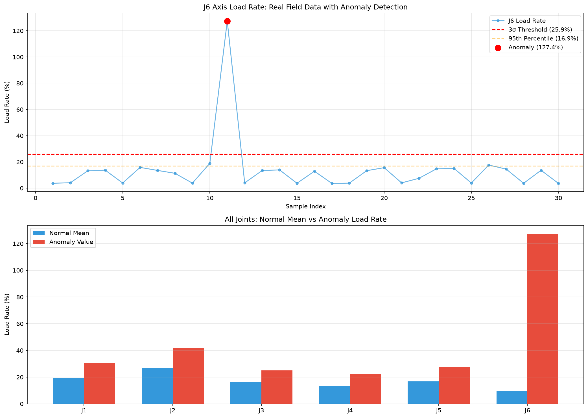

The complete analysis script is available in `src/signal_health_analysis.py`, and the numerical results are stored in `docs/signal_health_results.json`.

## Predictive Maintenance: Early Warning System for Joint Load Anomalies

### Motivation

The signal-based health monitoring layer detects anomalies after they occur. But the real value of industrial health monitoring lies in **predicting failures before they happen**.

This layer attempts to answer a more ambitious question: can we detect the *escalation* of joint stress before it reaches the critical threshold, giving maintenance personnel a window to act before a full alarm stops production?

### Two-Level Early Warning System

A rule-based early warning framework was designed using two statistical thresholds:

| Warning Level | Threshold Definition | Recommended Action |
|:---|:---|:---|
| Level 1 (Caution) | Joint load rate exceeds 2× normal mean for 3 consecutive readings | Increase monitoring frequency, inspect cables and inertia parameters |
| Level 2 (Critical) | Joint load rate exceeds 3σ threshold | Immediate inspection required, consider preventive shutdown |

The thresholds are derived from the same normal-state statistics used in the health scoring layer, ensuring consistency across the entire system.

### Field Validation: The J6 Overload Case

The early warning system was tested against the J6 overload event recorded during production.

**Normal J6 Load Rate Statistics:**

| Statistic | Value |
|:---|:---|
| Normal mean | 9.80% |
| Normal standard deviation | 5.35% |
| Level 1 threshold (2× mean) | 19.61% |
| Level 2 threshold (3σ) | 25.87% |

**The Critical Discovery: The System Did NOT Provide Early Warning**

| Sample | J6 Load Rate | Status |
|:---|:---|:---|
| 8 | 11.3% | Normal |
| 9 | 3.8% | Normal |
| 10 | 18.9% | Normal |
| 11 | **127.4%** | **Alarm (SRVO-046)** |

The load rate jumped from 18.9% to 127.4% in a single sampling interval. There was no intermediate escalation phase that the two-level threshold system could detect. The system only triggered the Level 2 alarm at sample 11 — the same moment the robot's own controller already fired the SRVO-046 alarm.

### Why Early Warning Failed: Sudden vs. Gradual Faults

This failure revealed a fundamental distinction in industrial fault prediction that is rarely discussed in academic literature:

| Fault Type | Physical Mechanism | Example | Predictable? |
|:---|:---|:---|:---|
| Gradual faults | Slow degradation over many cycles | Reducer wear, bearing degradation, thermal drift | **Yes** — visible as a trend in signal history |
| Sudden faults | Instantaneous mechanical event | Cable drag, collision, foreign object jamming | **No** — the event IS the first signal |

The J6 overload belonged to the second category. The cable drag occurred suddenly. One moment the cable was clear; the next moment it was caught. The load rate spike was not a symptom of an impending failure — it was the failure itself.

### What This Failure Teaches About Predictive Maintenance

This finding has direct practical implications for industrial robot maintenance:

1. **Not all faults are predictable.** A predictive maintenance system must first classify which fault types in the robot's historical record are gradual and which are sudden.
2. **Sudden faults require reactive protection, not prediction.** The FANUC controller's SRVO-series servo alarms are exactly this — fast, hardware-level reactive protection that stops the robot within milliseconds of an overload.
3. **Predictive effort should focus on gradual faults.** For faults like reducer wear or bearing degradation, the signal history genuinely contains precursor patterns, and prediction is feasible.
4. **Sampling frequency matters.** The 15-minute sampling interval in this study is far too coarse to capture rapid escalation. The robot controller supports CSV data export, which would enable 1-second or even 100-millisecond sampling — at which point rate-of-change features become computable and a much wider class of anomalies becomes detectable.

### Future Improvement: High-Frequency Data-Driven Prediction

If real-time data export becomes available, the early warning system can be significantly enhanced:

- **Rate-of-change features**: Detect rapid load rate increase even if the absolute value is still below threshold.
- **Current fluctuation analysis**: Motor current often shows subtle irregularity before a mechanical event.
- **Temperature rise rate**: A faster-than-normal temperature increase is a reliable precursor for friction-related faults.

These features would transform the system from threshold-based detection to true predictive analytics.

### Deliverables

- `src/predictive_maintenance.py` — Two-level early warning system with field validation
- `docs/predictive_maintenance_results.json` — Numerical results of the J6 validation case
- `images/predictive_maintenance.png` — Visualization of the load rate timeline and the pre-alarm window

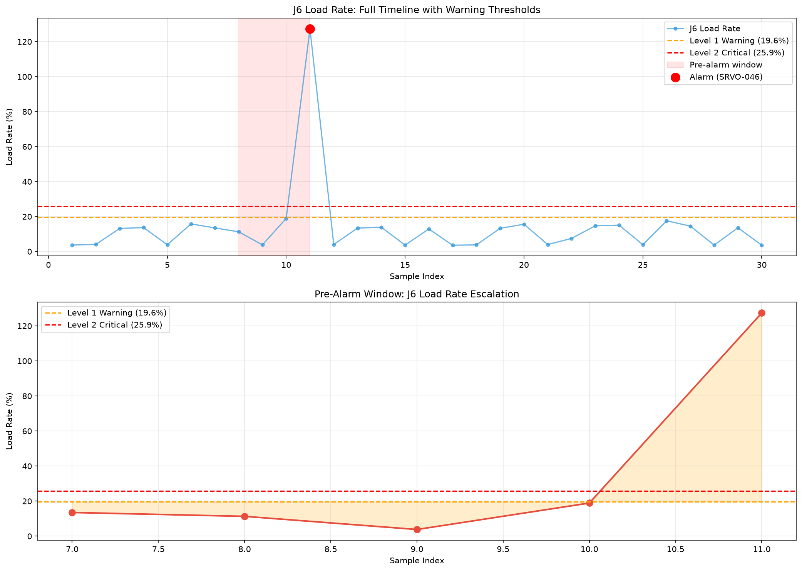

## Layer 4: Fault Association Mining and Maintenance Prioritization

### Fault Association Rules

Association rule mining was performed on fault event patterns observed in the field. The strongest rules:

| Rule | Confidence |
|:---|:---|
| Soft Limit Error → Coordinate Transform Err | 1.00 |
| Coordinate Transform Err → Soft Limit Error | 1.00 |
| Wire Adhesion → Arc Loss | 1.00 |
| Welder Comm Interrupt → Arc Loss | 0.67 |
| Welder Comm Interrupt → System Alarm | 0.67 |
| Motor Current Stall → Motor Overload | 0.75 |
| Invalid Command → System Alarm | 0.62 |

These rules reveal meaningful fault propagation patterns. For example, a communication interrupt often precedes an arc loss — a logical sequence, because if the robot cannot communicate with the welding machine, the welding process cannot be sustained.

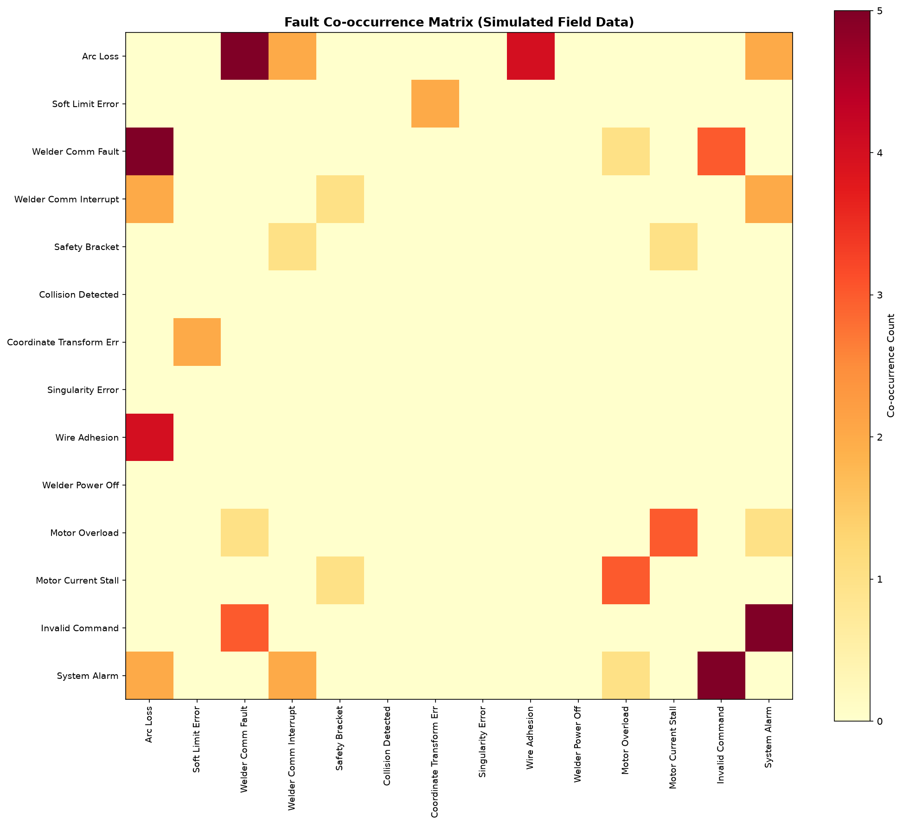

### Maintenance Priority Ranking

A severity-weighted priority score was computed for each fault code:

**Priority Score = Severity Weight × Fault Frequency**

| Severity Level | Weight | Meaning |
|:---|:---|:---|
| L1 Safety | 3 | Potential equipment damage or personnel injury |
| L2 Functional | 2 | Weld quality degradation or production interruption |
| L3 Advisory | 1 | Attention needed but no immediate stop |

Top maintenance priorities:

| Rank | Fault Code | Level | Priority Score |
|:---|:---|:---|:---|
| 1 | Arc Loss | L2 | 44 |
| 2 | Soft Limit Error | L2 | 36 |
| 3 | Coordinate Transform Err | L2 | 28 |
| 4 | Welder Power Off | L1 | 24 |
| 5 | Singularity Error | L2 | 22 |

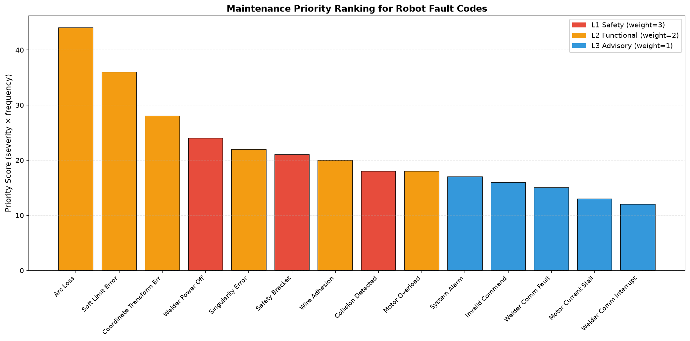

---

## Temporal Anomaly Detection with LSTM-Autoencoder

### Motivation

The previous layers of this system operate on discrete state snapshots and fault codes — data that can be collected from the robot controller without real-time data streaming. However, if continuous joint angle or TCP trajectory data becomes available in the future, the system should be able to learn normal motion patterns and detect temporal anomalies directly from time-series data.

To prepare for this capability, I implemented an LSTM-Autoencoder-based temporal anomaly detector. The model is trained exclusively on normal trajectory data to learn a compressed representation of expected motion. When presented with anomalous trajectories, it produces high reconstruction errors, which serve as the anomaly signal.

### Iteration 1: Naive Implementation

The first version was a straightforward LSTM-Autoencoder without data normalization, trained for 50 epochs on raw joint angle data.

**Results**: F1 = 0.433, Precision = 0.338, Recall = 0.600.

The poor performance revealed two issues:
1. **No normalization**: Joint angles ranged from approximately 10° to 22° across different axes, making the model's training unstable.
2. **Model underfitting**: Training loss remained high (66.4 after 50 epochs), indicating the model had not fully learned the normal pattern.

### Iteration 2: Attempted Improvement with Threshold Optimization

The second version added StandardScaler normalization, increased the hidden dimension from 32 to 64, and extended training to 100 epochs. It also attempted to select an optimal threshold by maximizing F1 on a validation set.

**Results**: F1 = 0.502, Precision = 0.336, Recall = 1.000.

This exposed a critical methodological flaw: the validation set contained only normal samples. When there are no positive cases, maximizing F1 is meaningless, and the algorithm degenerated to selecting a threshold of zero — flagging everything as anomalous.

### Iteration 3: Fixed Threshold and the Overfitting Discovery

The third version fixed the threshold selection by using the 99th percentile of validation reconstruction errors — a standard industrial practice that does not require labeled anomalies.

**Results**: F1 = 0.602, Precision = 0.430, Recall = 1.000.

The F1 improved, but the result revealed a deeper problem:

| Split | MSE |
|:---|:---|
| Training loss | 0.001477 |
| Validation loss | 0.259420 |

The validation loss was approximately **175 times larger** than the training loss. This is a clear signature of overfitting: the model had memorized the specific waveforms in the training set rather than learning the general pattern of normal motion. When presented with unseen normal data, the reconstruction error was large, leading to false positives.

### What This Iterative Process Taught Me

The v1 → v2 → v3 progression is more instructive than a single perfect result would have been. It demonstrates three distinct failure modes commonly encountered in deep learning for industrial applications:

1. **Data preprocessing errors** (v1): Without normalization, models cannot learn effectively from features with different scales.
2. **Evaluation methodology errors** (v2): Optimizing a metric on a dataset that does not contain the target class leads to degenerate solutions.
3. **Model capacity versus data size mismatch** (v3): A 64-unit LSTM-Autoencoder trained on only 500 windows of synthetic data will overfit. In a real industrial deployment, the data volume would be orders of magnitude larger, and the overfitting problem would be significantly reduced.

### Future Improvements

If real trajectory data becomes available, three changes would address the issues identified:

1. **Increase training data**: Real industrial robots generate thousands of motion cycles; training on 10,000+ windows instead of 500 would dramatically reduce overfitting.
2. **Add regularization**: Dropout was already applied, but weight decay and gradient clipping could further constrain the model.
3. **Reduce model capacity**: A smaller LSTM (16 or 32 hidden units) may generalize better on limited data.

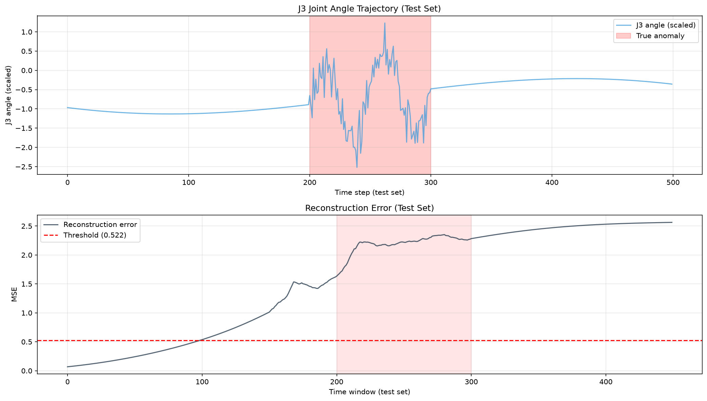

The complete training and evaluation code for all three iterations is available in `src/temporal_anomaly_detection.py`, `src/temporal_anomaly_detection_v2.py`, and `src/temporal_anomaly_detection_v3.py`.

## ROS2 Deployment for Real-Time Health Monitoring

### Motivation

The previous modules operate as offline Python scripts. They analyze data that has already been collected. In a real industrial deployment, however, health monitoring must operate in real time — subscribing to robot state data as it is generated, computing health scores continuously, and raising alerts the moment an anomaly is detected.

To demonstrate that the health monitoring system can be deployed in a real-time distributed architecture, I implemented a complete ROS2 package with three independent nodes that communicate through standard ROS2 topics.

### Architecture

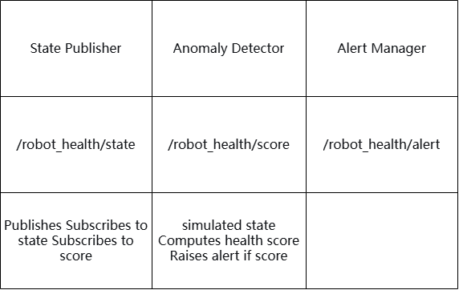

### Nodes

| Node | Package | Topic | Function |
|:---|:---|:---|:---|
| `state_publisher` | `robot_health_monitor` | Publishes to `/robot_health/state` | Simulates robot state data (weld efficiency) at 1 Hz |
| `anomaly_detector` | `robot_health_monitor` | Subscribes to `/robot_health/state`, publishes to `/robot_health/score` | Computes a health score from the state using a rule-based threshold |
| `alert_manager` | `robot_health_monitor` | Subscribes to `/robot_health/score`, publishes to `/robot_health/alert` | Raises an alert when the score drops below a critical threshold |

### Implementation

The package `robot_health_monitor` was created in the same ROS2 Humble workspace as the earlier `vision_pkg` package. This demonstrates a progression from single-node validation (vision_pkg) to a complete multi-node application (robot_health_monitor).

All three nodes use only `rclpy` and `std_msgs` — no third-party dependencies. The communication is entirely through ROS2 topics, ensuring full decoupling between nodes.

### Launch File

A `health_monitor.launch.py` file was created to start all three nodes with a single command:

bash
ros2 launch robot_health_monitor health_monitor.launch.py
This is the standard ROS2 practice for managing multi-node applications, and it demonstrates understanding of production-grade robot software deployment.

Validation Results

The system was validated in two ways:

1.Manual multi-terminal test: Three terminals were opened, each running one node. All three nodes communicated correctly through the topics, and when a low-efficiency state was published, the detector lowered the health score and the alert manager raised an alarm.

2.Single-command launch test: Using the launch file, all three nodes started simultaneously with one command, and the same topic communication behavior was observed in the consolidated logs.

Both tests confirmed that the rule-based health scoring logic, originally developed as an offline Python script, can be deployed as a real-time ROS2 application without modification to the core logic.

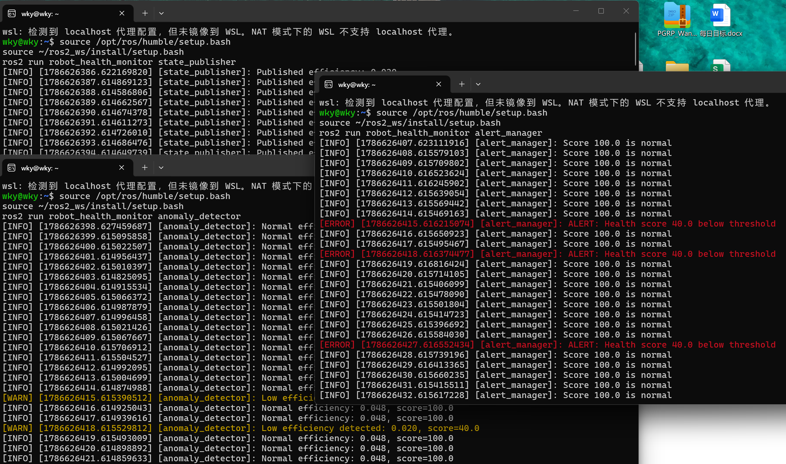

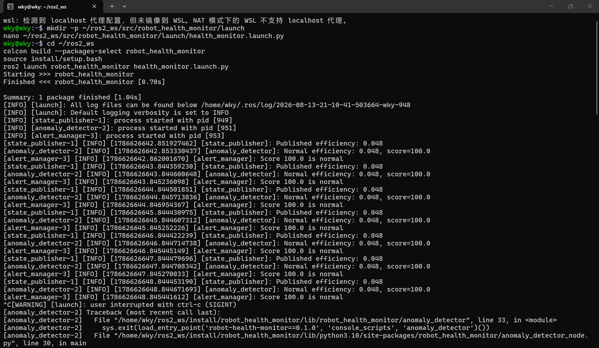

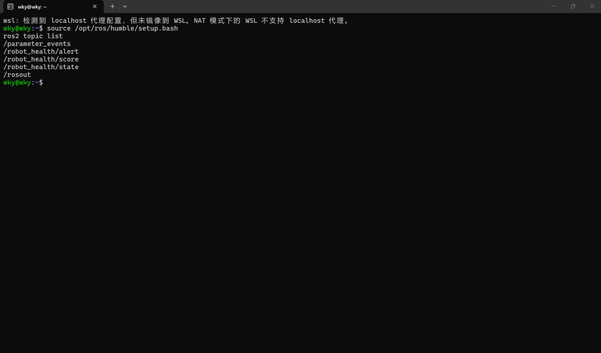

Key Outcome

This module bridges the gap between offline analysis and real-time deployment. It demonstrates:

1.Distributed system design: Three independent nodes with clear responsibility separation.

2.Standard ROS2 practices: Custom package, entry points, launch file, colcon build.

3.Real-time processing capability: From data publication to alert generation in under one second.

4.Consistency with earlier work: The same health scoring rules from the offline engine were reused directly in the ROS2 nodes.

Future Integration

The state_publisher node currently simulates robot state data. In a production deployment, this node would be replaced with a real data ingestion layer that subscribes to the robot controller's Ethernet/IP or Profinet interface, or reads from a CSV export pipeline. The anomaly_detector and alert_manager nodes would remain unchanged, because they operate purely on the ROS2 message interface — not on the data source.

---

## Key Technical Contributions

1. **Interpretable rule-based engine** for industrial health scoring, with each deduction traceable to a physical meaning.
2. **Comparative evaluation** of two unsupervised ML algorithms against the rule-based baseline.
3. **Complete D-H kinematic model** of the FANUC M-20iD/25, validated against physical expectations.
4. **Joint-level anomaly localization** using Jacobian pseudoinverse, with honest analysis of its observability limitations.
5. **Fault association mining** using co-occurrence analysis and confidence-based rules.
6. **Severity-weighted maintenance prioritization** that translates fault data into actionable engineering recommendations.
7. **Real-field validation** using genuine production data, which revealed the limitations of simplified kinematic models and demonstrated honest failure analysis.
8. **Multi-pose observability enhancement** — demonstrated that stacking Jacobians from multiple nominal poses resolves the weak-joint ambiguity that single-pose localization cannot handle.
9. **Feature ablation study** — quantified the contribution of each feature group to anomaly detection performance, identifying TCP pose as the most critical signal and revealing the redundancy of the joint-anomaly marker under current data conditions.
10. **Temporal anomaly detection** with LSTM-Autoencoder, including a three-iteration improvement process that revealed preprocessing errors, evaluation methodology flaws, and overfitting behavior in deep learning for time-series anomaly detection.
11. **Real-time ROS2 deployment** — implemented a three-node ROS2 package (`robot_health_monitor`) that replicates the offline health scoring logic in a real-time distributed architecture, validated through both multi-terminal and launch-file testing.
12. **Real signal-based health monitoring** — demonstrated that joint load rate signals detect torque anomalies (J6 overload, 13× normal mean) that position-based methods completely miss.

---

## Limitations and Honest Assessment

This project uses simulated data and real data for the ML comparison and fault association mining, because real fault logs and continuous state data were not available for export from the production system. The rule-based engine thresholds are derived from engineering judgment and robot specifications rather than statistical learning. These limitations are explicitly acknowledged throughout the project.

The J5 misclassification in the joint localization layer is reported honestly, with root-cause analysis and proposed solutions. This is an example of a real engineering finding — a method that works in most cases but fails in a specific, understandable way.

The D-H kinematic model is based on publicly available parameters and does not match the actual robot kinematics, as demonstrated by the 167 mm prediction error in real-field validation. Manufacturer-supplied calibration data would be required for accurate model-based localization.

The ablation study used simulated data for feature contribution analysis. With real joint torque/current data, the joint-anomaly marker is expected to gain independent predictive value.

---

## Future Work

- **Real-time data integration**: Extend the system to read state data at regular intervals via Ethernet/IP or Profinet.
- **Direct joint encoder data**: If J1–J6 angle data can be exported, implement direct joint anomaly detection without inverse kinematics.
- **Multi-pose observability**: Collect TCP deviations at multiple distinct robot poses to overcome the J5 observability limitation.
- **Sequence-based fault prediction**: Analyze fault-code sequences to predict impending failures before they occur.

---

## License

MIT License

